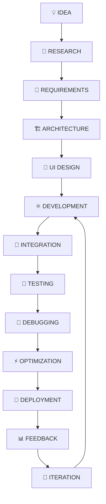

<div align="center">


<br>

<a href="https://github.com/rashid1351"></a>
<a href="https://rashidazam.me"></a>
<a href="https://github.com/rashid1351?tab=repositories"></a>
<a href="mailto:contact@rashidazam.me"></a>

<br><br>


<br><br>


<br><br>

### ⚡ BUILDING • LEARNING • ENGINEERING • INNOVATING

> **"Don't just write code. Build experiences, solve problems, and create something people can use."**

</div>

---

<div align="center">

## 🐍 CONTRIBUTION SNAKE


<sub>⚙️ Auto-generated nightly via GitHub Actions — see <a href="#-snake-animation-workflow-setup">setup instructions</a> below.</sub>

</div>

---

# 👨‍💻 RASHID AZAM — DEVELOPER PROFILE

<div align="center">

```text
╔══════════════════════════════════════════════════════════════════╗
║                                                                  ║
║                         👨‍💻 RASHID AZAM                         ║
║                                                                  ║
║                    FRONTEND DEVELOPER                            ║
║                                                                  ║
║       ⚛️ React        🟨 JavaScript       🔷 TypeScript          ║
║       🎨 UI/UX        📱 Responsive       ⚡ Performance         ║
║       🔌 APIs         📦 State             🤖 AI & Automation     ║
║                                                                  ║
║                  🚀 ALWAYS BUILDING SOMETHING                    ║
║                                                                  ║
╚══════════════════════════════════════════════════════════════════╝
```

</div>

<table>
<tr>
<td width="50%" valign="top">

## 👤 Identity

* **Name:** Rashid Azam
* **GitHub:** `rashid1351`
* **Primary Role:** Frontend Developer
* **Specialization:** Modern Web Development
* **Internship:** Zynxis Frontend Development
* **Duration:** 8 Weeks
* **Repository:** Public
* **Status:** 🟢 Completed

</td>
<td width="50%" valign="top">

## 🎯 Engineering Focus

* ⚛️ React Applications
* 🟨 JavaScript / TypeScript
* 🎨 UI/UX Engineering
* 📱 Responsive Interfaces
* 🔌 API Integration
* 📦 State Management
* ⚡ Performance Engineering
* 🤖 AI-powered Applications
* ⚙️ Automation

</td>
</tr>
</table>

---

# 🌐 DIGITAL PRESENCE

<div align="center">

| Platform        | Link                                                               |
| ---------------- | ------------------------------------------------------------------ |
| 👨‍💻 GitHub    | [github.com/rashid1351](https://github.com/rashid1351)             |
| 🌐 Portfolio    | [rashidazam.me](https://rashidazam.me)                             |
| 📂 Repositories | [Explore Projects](https://github.com/rashid1351?tab=repositories) |

</div>

---

# 🧠 ABOUT THE DEVELOPER

I am a **Frontend Developer and technology enthusiast** focused on creating modern, responsive, interactive and practical digital experiences.

My development philosophy combines:

```text
                         💡 IDEA
                           │
                           ▼
                      🧠 THINK
                           │
                           ▼
                      📝 PLAN
                           │
                           ▼
                     🎨 DESIGN
                           │
                           ▼
                    ⚛️ DEVELOP
                           │
                           ▼
                     🧪 TEST
                           │
                           ▼
                    🐛 DEBUG
                           │
                           ▼
                   ⚡ OPTIMIZE
                           │
                           ▼
                    🚀 DEPLOY
                           │
                           ▼
                    📈 IMPROVE
```

I believe great frontend development is not simply about making a page look good.

It is about combining:

**Design + Engineering + Performance + Accessibility + User Experience + Maintainability**

---

# 🧬 DEVELOPER DNA

```javascript
const rashidAzam = {
    name: "Rashid Azam",
    username: "rashid1351",

    role: "Frontend Developer",

    stack: {
        frontend: [
            "HTML5",
            "CSS3",
            "JavaScript",
            "TypeScript",
            "React"
        ],

        styling: [
            "Tailwind CSS",
            "Responsive Design",
            "Animations",
            "Modern UI"
        ],

        data: [
            "REST APIs",
            "JSON",
            "Async/Await",
            "CRUD"
        ],

        tools: [
            "Git",
            "GitHub",
            "VS Code",
            "Vite",
            "npm"
        ]
    },

    interests: [
        "Web Development",
        "AI",
        "Automation",
        "Digital Products",
        "UI/UX",
        "Performance"
    ],

    philosophy:
        "Build useful things. Keep learning. Keep improving."
};
```

---

# 🏗️ ENGINEERING STACK

## 🌐 WEB FOUNDATION

<div align="center">


<br><br>


</div>

---

# ⚛️ FRONTEND ENGINEERING

<div align="center">


</div>

### Core capabilities

* ⚛️ React development
* 🪝 React Hooks
* 🧩 Component architecture
* ♻️ Reusable components
* 🔄 Dynamic rendering
* 🎯 Conditional rendering
* 🧠 State-driven UI
* ⚡ Modern build systems
* 📱 Responsive frontend architecture

---

# 🎨 UI / UX ENGINEERING

<div align="center">


</div>

### Focus areas

* 🎨 Modern interface design
* 📱 Mobile-first development
* 📐 Flexbox
* 🔲 CSS Grid
* ✨ Micro-interactions
* 🌀 Transitions
* 🎬 Animations
* 🌙 Dark / Light themes
* ♿ Accessibility-aware interfaces
* 🧩 Design consistency

---

# 🔌 API & APPLICATION ENGINEERING

```text
┌─────────────────────────────────────────────┐
│                FRONTEND APP                 │
├─────────────────────────────────────────────┤
│                                             │
│  🖥️ UI                                     │
│      ↓                                      │
│  🧠 Application Logic                       │
│      ↓                                      │
│  🔌 API Client                              │
│      ↓                                      │
│  🌐 REST API                                │
│      ↓                                      │
│  📦 JSON Data                               │
│      ↓                                      │
│  🔄 State Update                            │
│      ↓                                      │
│  🎨 UI Re-render                            │
│                                             │
└─────────────────────────────────────────────┘
```

### Practical areas

* REST API integration
* Fetch API
* Async/Await
* JSON processing
* Loading states
* Error handling
* CRUD workflows
* Dynamic data rendering

---

# 🤖 AI & AUTOMATION INTEREST

Beyond traditional frontend development, I am interested in the rapidly evolving intersection of:

```text
🤖 Artificial Intelligence
        +
🌐 Web Applications
        +
⚙️ Automation
        +
🔌 APIs
        =
🚀 Intelligent Digital Products
```

Areas of exploration include:

* AI-powered web applications
* AI APIs
* Conversational interfaces
* Automation workflows (n8n, webhooks)
* AI-enhanced user experiences
* Intelligent digital tools

---

# 🧰 DEVELOPMENT TOOLKIT

<div align="center">


<br><br>


</div>

---

# 🏆 ZYNXIS — 8 WEEK FRONTEND JOURNEY

<div align="center">

| WEEK | MODULE                     | PRIMARY OUTCOME          | STATUS |
| :--: | -------------------------- | ------------------------ | :----: |
|  01  | 📱 Responsive Layouts      | Responsive interfaces    |    ✅   |
|  02  | 🧩 Component Library       | Reusable architecture    |    ✅   |
|  03  | ⚡ Dynamic Interactions     | Interactive applications |    ✅   |
|  04  | 🎨 Styling & Animations    | Modern UI                |    ✅   |
|  05  | 🔌 API Integration         | Dynamic data             |    ✅   |
|  06  | 📦 State Management        | Application state        |    ✅   |
|  07  | ⚡ Performance Optimization | Faster applications      |    ✅   |
|  08  | 🏆 Final Dashboard         | Complete product         |    ✅   |

### 🎯 RESULT

**8 / 8 WEEKS COMPLETED**

</div>

---

# 📱 WEEK 01 — RESPONSIVE ENGINEERING

### Objective

Build interfaces capable of adapting to different screen sizes and devices.

### Concepts

```text
📱 Mobile
   ↓
📲 Tablet
   ↓
💻 Laptop
   ↓
🖥️ Desktop
   ↓
🖥️ Ultra-wide
```

### Skills

* Mobile-first CSS
* Flexbox
* CSS Grid
* Media queries
* Responsive navigation
* Fluid layouts
* Cross-device testing

**STATUS → ✅ COMPLETED**

---

# 🧩 WEEK 02 — COMPONENT ARCHITECTURE

### Objective

Learn to create reusable and maintainable frontend components.

```text
                 🧩 COMPONENT
                      │
          ┌───────────┼───────────┐
          ▼           ▼           ▼
        🔘 Button    🃏 Card     📝 Form
          │           │           │
          └───────────┼───────────┘
                      ▼
                 ♻️ REUSABLE UI
```

### Skills

* Component composition
* Reusability
* Props
* UI consistency
* Component organization

**STATUS → ✅ COMPLETED**

---

# ⚡ WEEK 03 — DYNAMIC INTERACTIONS

### Objective

Transform static interfaces into interactive applications.

```text
USER
 │
 ▼
🖱️ ACTION
 │
 ▼
⚡ EVENT
 │
 ▼
🧠 STATE
 │
 ▼
🔄 UPDATE
 │
 ▼
🎨 UI
```

### Skills

* React Hooks
* Event handling
* Dynamic rendering
* Conditional rendering
* Interactive UI
* State-based interfaces

**STATUS → ✅ COMPLETED**

---

# 🎨 WEEK 04 — STYLING & MOTION

### Objective

Create polished, modern and engaging interfaces.

### Focus

* 🎨 Visual hierarchy
* ✨ Animations
* 🌀 Transitions
* 🖱️ Hover states
* 📱 Responsive styling
* 🌙 Theme systems
* 🎬 Micro-interactions

> **Motion should communicate, guide and enhance the experience.**

**STATUS → ✅ COMPLETED**

---

# 🔌 WEEK 05 — API INTEGRATION

### Objective

Connect frontend applications to real data sources.

### Engineering flow

```text
UI
 ↓
REQUEST
 ↓
API
 ↓
SERVER
 ↓
JSON
 ↓
VALIDATION
 ↓
STATE
 ↓
UI
```

### Skills

* REST APIs
* Fetch
* Async/Await
* JSON
* Loading states
* Error states
* Dynamic rendering
* API-driven applications

**STATUS → ✅ COMPLETED**

---

# 📦 WEEK 06 — STATE MANAGEMENT

### Objective

Understand how application data flows through a modern frontend.

```text
USER ACTION
     ↓
STATE
     ↓
STORE / LOGIC
     ↓
DATA UPDATE
     ↓
COMPONENTS
     ↓
UI
```

### Skills

* State management
* Data flow
* Component communication
* Persistent state
* Dynamic updates
* Application logic

**STATUS → ✅ COMPLETED**

---

# ⚡ WEEK 07 — PERFORMANCE ENGINEERING

### Objective

Build applications that are fast, efficient and user-friendly.

### Optimization areas

* 💤 Lazy loading
* 🖼️ Image optimization
* 📦 Component optimization
* ⚡ Rendering efficiency
* 🧹 Code optimization
* 📱 Mobile performance
* 🔍 Lighthouse auditing

### Performance philosophy

```text
FAST
 +
RESPONSIVE
 +
EFFICIENT
 +
ACCESSIBLE
 =
BETTER USER EXPERIENCE
```

**STATUS → ✅ COMPLETED**

---

# 🏆 WEEK 08 — FINAL CAPSTONE

# 🚀 ZYNXIS CLIENT DASHBOARD

The final project combines the concepts developed during the entire internship into a complete **client management dashboard**.

### 🎯 Project Goal

Create a professional SaaS-style frontend capable of managing client data through an intuitive, responsive and interactive interface.

---

# 💎 FINAL PROJECT — FEATURE MATRIX

| Area          | Features                             |
| ------------- | ------------------------------------ |
| 📊 Dashboard  | Statistics, summaries, visualization |
| 👥 Clients    | Create, read, update, delete         |
| 🔍 Search     | Dynamic client search                |
| 🎯 Filters    | Client filtering                     |
| 📝 Forms      | Validation & user feedback           |
| 🌙 Theme      | Dark / Light mode                    |
| 🔔 Feedback   | Notifications                        |
| 📱 Responsive | Mobile → Desktop                     |
| ✨ Motion      | Transitions & interactions           |
| ⚡ Performance | Optimized frontend                   |
| 💾 State      | Persistent application state         |

---

# 🔄 CRUD ENGINE

```text
              👥 CLIENT SYSTEM
                    │
       ┌────────────┼────────────┐
       │            │            │
       ▼            ▼            ▼
      ➕           👁️           🔍
    CREATE        READ         SEARCH
       │            │
       └──────┬─────┘
              ▼
             ✏️
           UPDATE
              │
              ▼
             🗑️
           DELETE
```

---

# 🏗️ APPLICATION ARCHITECTURE

```text
                         🚀 APPLICATION
                               │
          ┌────────────────────┼────────────────────┐
          │                    │                    │
          ▼                    ▼                    ▼
      🎨 UI LAYER         🧠 LOGIC LAYER       💾 DATA LAYER
          │                    │                    │
    ┌─────┼─────┐        ┌────┼────┐          ┌────┼────┐
    │     │     │        │    │    │          │    │    │
  Navbar Cards Forms    State CRUD Search    Data Persist Query
    │     │     │        │    │    │          │    │    │
    └─────┼─────┘        └────┼────┘          └────┼────┘
          │                    │                    │
          └────────────────────┼────────────────────┘
                               ▼
                       📊 USER EXPERIENCE
```

---

# 📂 REPOSITORY ARCHITECTURE

```text
zynxis-internship-rashid-azam/
│
├── 📁 Week1_Responsive_layouts/
│   ├── source/
│   ├── screenshots/
│   └── README.md
│
├── 📁 Week2_Component_library/
│   ├── source/
│   ├── screenshots/
│   └── README.md
│
├── 📁 Week3_Dynamic_Interactions/
│   ├── source/
│   ├── screenshots/
│   └── README.md
│
├── 📁 Week4_Styling_Animations/
│   ├── source/
│   ├── screenshots/
│   └── README.md
│
├── 📁 Week5_API_Integration/
│   ├── source/
│   ├── screenshots/
│   └── README.md
│
├── 📁 Week6_State_Management/
│   ├── source/
│   ├── screenshots/
│   └── README.md
│
├── 📁 Week7_Performance_Optimization/
│   ├── source/
│   ├── screenshots/
│   └── README.md
│
├── 📁 Week8_Final_Dashboard_Project/
│   ├── source/
│   ├── screenshots/
│   ├── documentation/
│   └── README.md
│
└── 📄 README.md
```

---

# 🧠 ENGINEERING PRINCIPLES

## ♻️ Reusability

Build components that can be reused rather than duplicated.

## 📱 Responsive by Default

Design for small screens first and scale gracefully.

## 🎨 UX First

A technically correct interface should still be intuitive.

## ⚡ Performance Matters

Fast experiences improve usability and engagement.

## 🧹 Clean Code

Readable code is easier to debug, maintain and scale.

## 🔐 Reliability

Handle errors, loading states and unexpected interactions.

## 📈 Continuous Improvement

Every project is an opportunity to become a better engineer.

---

# 🧪 DEVELOPMENT QUALITY CHECKLIST

```text
[✓] Responsive Design
[✓] Reusable Components
[✓] Dynamic Interactions
[✓] API Integration
[✓] State Management
[✓] CRUD Operations
[✓] Form Handling
[✓] Error Handling
[✓] Loading States
[✓] UI Animations
[✓] Dark / Light Mode
[✓] Performance Optimization
[✓] Git Version Control
[✓] GitHub Repository
[✓] Project Documentation
```

---

# 🔄 PROFESSIONAL DEVELOPMENT WORKFLOW



---

# 📊 GITHUB ANALYTICS DASHBOARD

<div align="center">


<br>


<br><br>


</div>

> 📌 **Note:** Analytics cards render live data pulled directly from the `rashid1351` GitHub account and update automatically on every profile visit — no manual refresh needed.

---

# 📈 8-WEEK PROGRESS

<div align="center">

```text
WEEK 01  ████████████████████  100%
WEEK 02  ████████████████████  100%
WEEK 03  ████████████████████  100%
WEEK 04  ████████████████████  100%
WEEK 05  ████████████████████  100%
WEEK 06  ████████████████████  100%
WEEK 07  ████████████████████  100%
WEEK 08  ████████████████████  100%

              ┌───────────────────────┐
              │   🏆 8 / 8 COMPLETE   │
              └───────────────────────┘
```

</div>

---

# 🧭 DEVELOPMENT ROADMAP

```text
                 CURRENT
                    │
                    ▼
           👨‍💻 FRONTEND DEVELOPMENT
                    │
       ┌────────────┼────────────┐
       ▼            ▼            ▼
    ⚛️ React      🔷 TS       🎨 UI/UX
       │            │            │
       └────────────┼────────────┘
                    ▼
             🏗️ ARCHITECTURE
                    │
                    ▼
              🧪 TESTING
                    │
                    ▼
              ⚡ PERFORMANCE
                    │
                    ▼
             ♿ ACCESSIBILITY
                    │
                    ▼
                🤖 AI
                    │
                    ▼
             ⚙️ AUTOMATION
                    │
                    ▼
          🚀 PRODUCTION SYSTEMS
```

---

# 🔭 FUTURE LEARNING

The journey continues beyond this internship.

### Next areas of growth

* ⚛️ Advanced React architecture
* 🔷 Advanced TypeScript
* 🧪 Frontend testing
* ♿ Accessibility engineering
* ⚡ Advanced performance
* 🏗️ Scalable architecture
* 🔐 Web security fundamentals
* 🤖 AI-powered applications
* ⚙️ Automation systems
* ☁️ Modern deployment workflows
* 🚀 Production-scale applications

---

# 🐍 SNAKE ANIMATION WORKFLOW SETUP

The animated contribution snake at the top of this README isn't automatic by default — it needs a one-time GitHub Actions setup on the `rashid1351/rashid1351` profile repository:

1. In that repo, create `.github/workflows/snake.yml`
2. Paste the standard `Platane/snk` action config targeting `github-contribution-grid-snake-dark.svg`
3. Set the workflow to run on a schedule (e.g. every 12 hours) and on push
4. Push once to generate the first `output` branch
5. The `` tag above will then render live automatically

---

# 🌐 PORTFOLIO

<div align="center">

<a href="https://rashidazam.me">

</a>

</div>

---

# 👨‍💻 GITHUB

<div align="center">

<a href="https://github.com/rashid1351">

</a>

<a href="https://github.com/rashid1351?tab=repositories">

</a>

</div>

---

# 🏅 ZYNXIS INTERNSHIP ACHIEVEMENT

<div align="center">

```text
╔══════════════════════════════════════════════════════════╗
║                                                          ║
║                 🚀 ZYNXIS INTERNSHIP                     ║
║                                                          ║
║                    👨‍💻 RASHID AZAM                       ║
║                                                          ║
║                 FRONTEND DEVELOPER                       ║
║                                                          ║
║                 ───────────────────                      ║
║                                                          ║
║                  📱 RESPONSIVE UI                        ║
║                  🧩 COMPONENT SYSTEM                     ║
║                  ⚡ DYNAMIC INTERACTION                  ║
║                  🎨 STYLING & ANIMATION                  ║
║                  🔌 API INTEGRATION                      ║
║                  📦 STATE MANAGEMENT                     ║
║                  ⚡ PERFORMANCE                          ║
║                  🏆 FINAL DASHBOARD                      ║
║                                                          ║
║                 ───────────────────                      ║
║                                                          ║
║                  8 / 8 WEEKS                            ║
║                     COMPLETE                             ║
║                                                          ║
╚══════════════════════════════════════════════════════════╝
```

</div>

---

# 🎯 PROFESSIONAL OBJECTIVE

> **To engineer modern digital experiences by combining clean frontend architecture, thoughtful user experience, responsive design, performance optimization and emerging technologies.**

---

# 💙 ACKNOWLEDGEMENT

A special thanks to **Zynxis** for providing the opportunity to strengthen frontend development skills through an intensive, structured and practical internship journey.

This repository represents the progression from foundational frontend concepts to a complete final dashboard project.

---

# 🔥 FINAL DEVELOPER STATEMENT

<div align="center">


<br><br>

# 👨‍💻 RASHID AZAM

### FRONTEND DEVELOPER

**React • JavaScript • TypeScript • UI/UX • APIs • Performance • AI**

<br>

<a href="https://github.com/rashid1351">

</a>

<a href="https://rashidazam.me">

</a>

<br><br>

### ⚡ BUILD • LEARN • CREATE • INNOVATE • GROW ⚡

<br>

**Thanks for visiting! ❤️**

</div>


